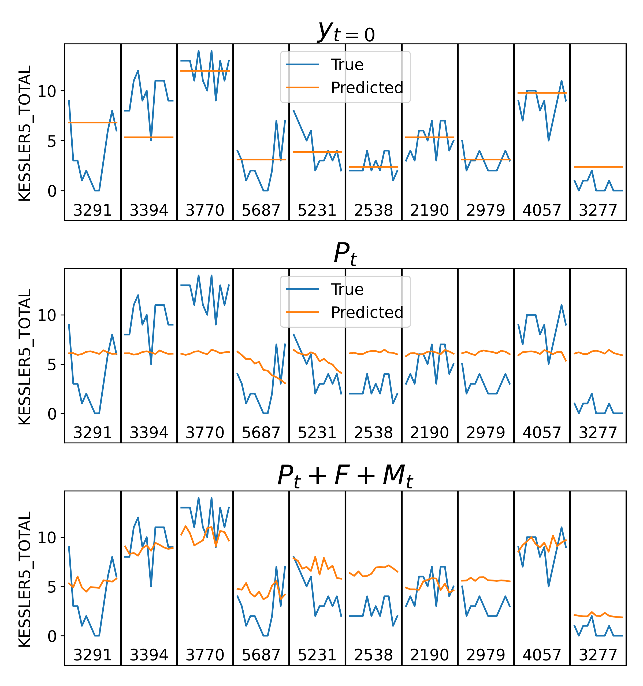
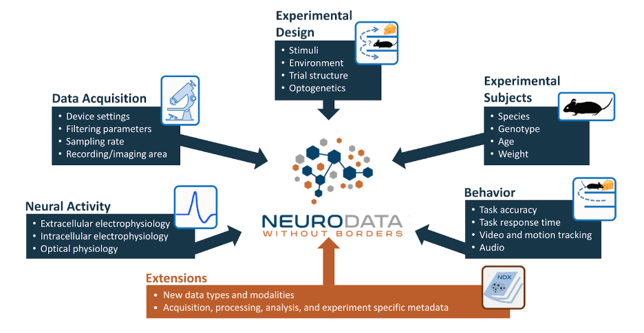
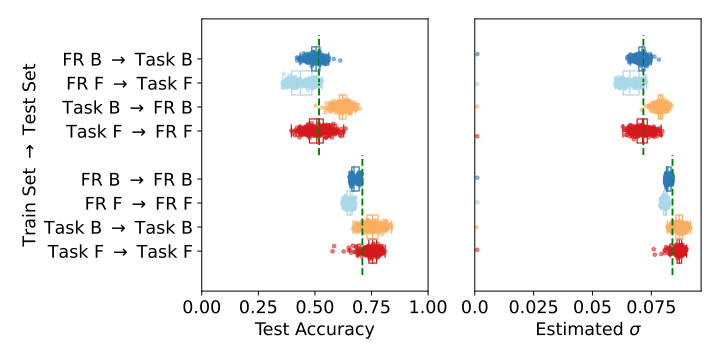
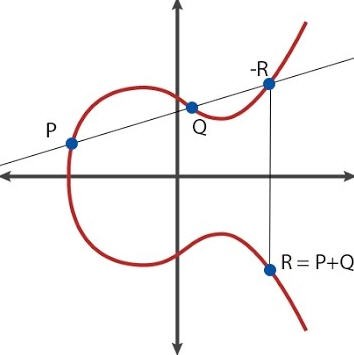



    

        
    

    

        <h2 style="font-size:1.5em;">Predicting pandemic mental health outcomes</h2>
    

The “Mental Health Impact of COVID-19 Pandemic on NIMH Patients and Volunteers” study was a longitudinal study launched in spring 2020 by researchers at NIMH, to investigate the effect of the emerging COVID-19 pandemic on mental health. For each participant, the study collected personal characteristics, such as demographics, psychological traits, and clinical history, together with personal circumstances at regular intervals during their enrollment in the study. In this paper, we examine the degree to which a variety of mental health outcomes over time for an individual can be predicted from personal characteristics and their changing circumstances, using regression models trained on other study participants. We find that it is possible to predict the variation of a participant's mental health outcomes from time point to time point, for most of the outcomes we consider. This capability is dominated by information about outcome at the point of enrollment in the study, but can be improved by considering personal characteristics and circumstances.

    

        
  

  

    <h2 style="font-size:1.5em;">Holographic photostimulation extension</h2>

State-of-the-art <a href="https://www.nature.com/articles/s41467-017-01031-3">holographic photostimulation methods</a>, 
used in concert with <a href="https://www.nature.com/articles/nmeth818">two-photon imaging</a>, allow unprecedented 
control and measurement of cell activity in the living brain. Methods for managing data for two-photon imaging 
experiments are improving, but there is little to no standardization of data for holographic stimulation methods. 
Stimulation in vivo depends on fine-tuning many experimental variables, which poses a challenge for reproducibility 
and data sharing between researchers. To improve <a href="https://www.sciencedirect.com/science/article/pii/S0896627321009557">standardization</a> of photostimulation data storage and processing, 
we release this extension as a generic data format for simultaneous holographic stimulation experiments, 
using the <a href="https://www.nwb.org/">NeuroData Without Borders (NWB)</a> format for neurophysiology data to store experimental details and data relating to both acquisition 
and photostimulation. It includes <a href="https://pynwb.readthedocs.io/en/stable/">containers</a> for storing photostimulation-specific device parameters, holographic patterns (either 2D or 3D), and time series data related to photostimulation. This project is part of an ongoing intra-NIMH collaboration between <a href="https://markhisted.org/">Mark Histed's lab</a> and the <a href="https://cmn.nimh.nih.gov/dsst">Data Science and Sharing Team</a>.

    

        
    

    

        <h2 style="font-size:1.5em;">Context-dependent encoding</h2>
    

We propose a decoding-based approach to detect context effects on neural codes in longitudinal neural recording data. The approach is agnostic to how information is encoded in neural activity, and can control for a variety of possible confounding factors present in the data. We demonstrate our approach by determining whether it is possible to decode location encoding from prefrontal cortex in the mouse and, further, testing whether the encoding changes due to task engagement.

    

        
        &nbsp;&nbsp;
        
    

    

        <h2 style="font-size:1.5em;">DeepAction Toolbox</h2>
    

  

   <table style="border:none;">
    <tr style="border:none">
        <td style="border:none;padding:0.2em" width="33%">
			
		</td>
		<td style="border:none;padding:0.2em" width="33%">
			
		</td>						
		<td style="border:none;padding:0.2em" width="33%">
			
		</td>
	</tr>
	<tr style="border:none;">
		<td style="border:none;padding:0.2em;" width="33%">
			
		</td>
		<td style="border:none;padding:0.2em" width="33%">
			
		</td>						
		<td style="border:none;padding:0.2em" width="33%">
			
		</td>
	</tr>
    </table>
  

  

    
The identification of animal behavior in video is a critical but time-consuming task in 
    many areas of research. Here, we introduce DeepAction, a deep learning-based toolbox for automatically annotating 
    animal behavior in video. Our approach uses features extracted from raw video frames by a pretrained convolutional 
    neural network to train a recurrent neural network classifier. We evaluate the classifier on two benchmark rodent 
    datasets and one octopus dataset. We show that it achieves high accuracy, requires little training data, and 
    surpasses both human agreement and most comparable existing methods. We also create a confidence score for 
    classifier output, and show that our method provides an accurate estimate of classifier performance and reduces the 
    time required by human annotators to review and correct automatically-produced annotations. We release our system 
    and accompanying annotation interface as an open-source MATLAB toolbox.

  

  

   
  

  

    <h2 style="font-size:1.5em;">HPC keypoint extraction</h2>
  

The purpose of this project is to enable the extraction of animal keypoints from very large video datasets via DeepLabCut, on the Dartmouth College <a href="https://rc.dartmouth.edu/index.php/discovery-overview/">Discovery HPC cluster</a>. Videos are recorded & uploaded to a folder in the user's DropBox account, after which the user selects a subset to extract annotations for. For subset, corresponding video files are first downloaded from DropBox onto the user's HPC accounts using an API key. Then, a trained DeepLabCut network is used to extract keypoints from the video. After keypoints have been extracted, the video is deleted, to clear space for the rest of the video files in the batch to be downloaded. In the final step, keypoints uploaded from the HPC to the user's specified DropBox folder.

    

        
    

    

        <h2 style="font-size:1.5em;">Elliptic curve cryptography</h2>
    

Final project for Abstract Algebra (Dartmouth College, Fall 2020) in which I implemented a simple elliptic curve cryptosystem in MATLAB. The corresponding <a href="https://github.com/carlwharris/elliptic-curve-cryptosystems/blob/main/ECC%20Project%20Paper.pdf">paper</a> includes information about: the invention of public key and elliptic curve cryptography, elliptic curves over finite fields, subgroup generation, and how cryptographic systems are constructed from elliptic curves and used to encrypt and decrypt messages.

