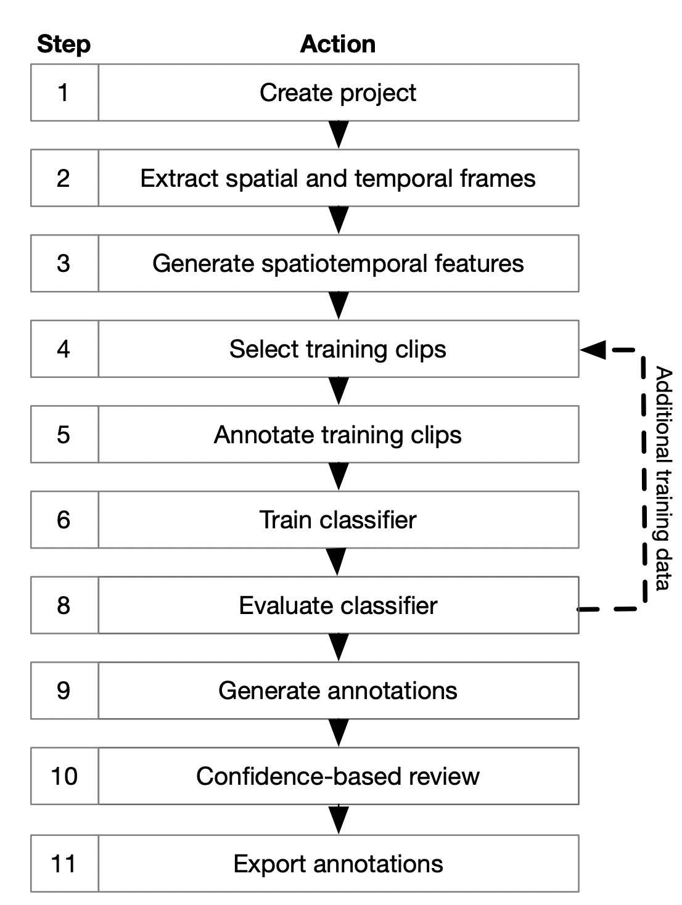
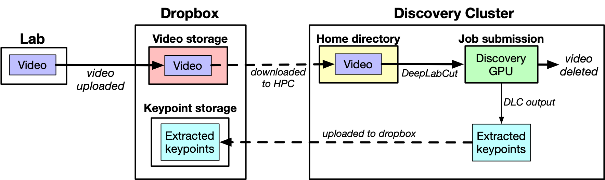



<table width="100%" style="border:none;margin:0;padding:0">
<td style="border:none;padding:0px;margin:0;" width="70%" align="left">
	<h1 style="font-size:2.5em;">DeepAction Toolbox</h1>
</td>
<td style="border:none;padding:0px;margin:0;"  align="right">
	
	&nbsp;&nbsp;
	
</td>
</table>

<table width="100%" style="margin:0;border:none;margin-top:-1.25em;padding:0;">
<tr style="width:100%;border:none;">
	<td style="border:none;padding:0px" width="60%">
		
In this project, I created a MATLAB toolbox for automated classification of animal in behavior. It uses features extracted from raw video frames to train a bidirectional LSTM classifier, which in addition to predicting behavior generates a confidence score for the predicted label. These confidence scores allow for the selective review and correction of ambiguous annotations while omitting unnecessary review.

	</td>
	<td style="border:none;padding:0px;vertical-align:top;" rowspan ="2">
		
	</td>
</tr>
<tr style="width:100%;border:none;background-color:rgba(0, 0, 0, 0);">
	<td style="border:none; padding:0px;vertical-align:top" width="60%">
		<table width="100%" style="margin:0;border:none;padding:0">
			<tr style="width:100%;border:none;margin:0;padding:0;">
				<td style="border:none;padding:0.2em" width="33%">
					
				</td>
				<td style="border:none;padding:0.2em" width="33%">
					
				</td>						
				<td style="border:none;padding:0.2em" width="33%">
					
				</td>
			</tr>
			<tr style="width:100%;border:none;margin:0;padding:0;">
				<td style="border:none;padding:0.2em;" width="33%">
					
				</td>
				<td style="border:none;padding:0.2em" width="33%">
					
				</td>						
				<td style="border:none;padding:0.2em" width="33%">
					
				</td>
			</tr>
		</table>
	</td>
</tr>
</table>

<!--<table width="100%" style="margin:0;border:none;margin-top:-1em;padding:0">
<tr style="width:100%;border:none;">
<td style="border:none;padding:0px" width="50%">

In this project, I created a MATLAB toolbox for automated classification of animal in behavior. It uses features extracted from raw video frames to train a bidirectional LSTM classifier, which in addition to predicting behavior generates a confidence score for the predicted label. These confidence scores allow for the selective review and correction of ambiguous annotations while omitting unnecessary review.

</td>
<td style="border:none;padding:0px;vertical-align:top;" rowspan ="3">

</td>
</tr>
<tr style="width:100%;border:none;background-color:rgba(0, 0, 0, 0);">
<td style="border:none; padding:0px;vertical-align:top" width="60%">

</td>
</tr>
<tr style="width:100%;border:none;background-color:rgba(0, 0, 0, 0);">
<td style="border:none; padding:0px;vertical-align:top;" width="60%">

</td>
</tr>
</table>

-->

<table width="100%" style="border:none;margin:0;padding:0">
<td style="border:none;padding:0px;margin:0" width="70%" align="left">
	<h1 style="font-size:2.5em;">HPC keypoint extraction</h1>
</td>
<td style="border:none;padding:0px;margin:0"  align="right">
	
</td>
</table>

<table width="100%" style="border:none;margin:0;padding:0;margin-top:-1.25em">
<tr style="width:100%;border:none;margin:0">
	<td style="border:none;padding:0px;margin:0" width="100%">
		
The purpose of this project is to enable the extraction of animal keypoints from very large video datasets via DeepLabCut, on the Dartmouth College <a href="https://rc.dartmouth.edu/index.php/discovery-overview/">Discovery</a> HPC cluster. Videos are recorded & uploaded to a folder in the user's DropBox account, after which the user selects a subset to extract annotations for. For subset, corresponding video files are first downloaded from DropBox onto the user's HPC accounts using an API key. Then, a trained DeepLabCut network is used to extract keypoints from the video. After keypoints have been extracted, the video is deleted, to clear space for the rest of the video files in the batch to be downloaded. In the final step, keypoints uploaded from the HPC to the user's specified DropBox folder.

	</td>
	</tr>
	<tr style="width:100%;border:none;margin:0;">
		<td style="border:none;padding:0px;margin:0;" width="100%" align="center">
			
		</td>
	</tr>
</table>

<table width="100%" style="border:none;margin:0;padding:0">
<td style="border:none;padding:0px;margin:0" width="70%" align="left">
	<h1 style="font-size:2.5em;">Elliptic curve cryptography</h1>
</td>
<td style="border:none;padding:0px;margin:0"  align="right">
	
</td>
</table>

Final project for Abstract Algebra (Dartmouth College, Fall 2020) in which I implemented a simple elliptic curve cryptosystem in MATLAB. The corresponding <a href="https://github.com/carlwharris/elliptic-curve-cryptosystems/blob/main/ECC%20Project%20Paper.pdf">paper</a> includes information about: the invention of public key and elliptic curve cryptography, elliptic curves over finite fields, subgroup generation, and how cryptographic systems are constructed from elliptic curves and used to encrypt and decrypt messages.

